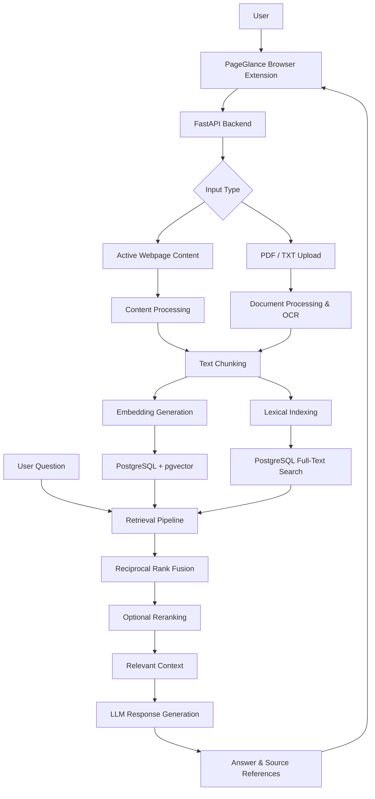
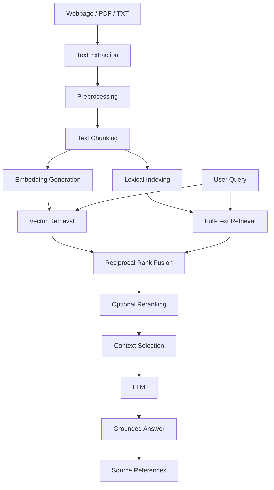
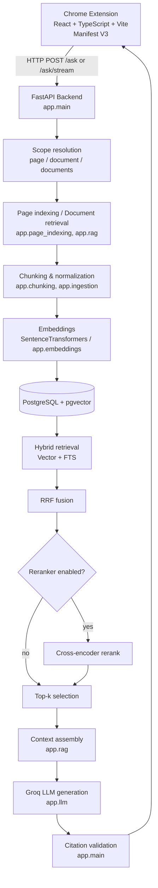

# 🧠 PageGlance

### An AI-Powered Browser Assistant for Context-Aware Webpage & Document Understanding

<p align="center">
  <a href="https://addons.mozilla.org/en-GB/firefox/addon/pageglance/"><strong>Firefox Add-on</strong></a> •
  <a href="https://github.com/anshh-py/PageGlance"><strong>GitHub Repository</strong></a> •
  <a href="https://ansh9057-pageglance-backend.hf.space"><strong>Backend API</strong></a>
</p>

<p align="center">
  
  
  
  
  
  
  
  
</p>

---

## Overview

**PageGlance** is an AI-powered browser assistant that enables users to understand, question, and explore information from webpages and documents through natural-language conversations.

Instead of manually searching through lengthy articles, navigating between sections, or repeatedly reading documents, users can ask questions directly about the content they are viewing.

PageGlance combines a browser extension with a Retrieval-Augmented Generation (RAG) backend to retrieve relevant context and generate answers grounded in the available source material.

The platform supports webpage question answering, PDF and TXT document ingestion, OCR-based text extraction, multi-document retrieval, and source-aware responses.

At its core, PageGlance is built around a **hybrid retrieval architecture** that combines semantic vector search with lexical full-text search, Reciprocal Rank Fusion (RRF), and optional reranking to improve the relevance of retrieved context before answer generation.

The project brings together browser-extension engineering, backend API development, document processing, vector databases, information retrieval, and LLM-powered response generation in one integrated application.

## Live Application & Resources

| Component | Resource |
|---|---|
| Firefox Add-on | [PageGlance on Mozilla Add-ons](https://addons.mozilla.org/en-GB/firefox/addon/pageglance/) |
| Backend API | [PageGlance Backend](https://ansh9057-pageglance-backend.hf.space) |
| GitHub Repository | [anshh-py/PageGlance](https://github.com/anshh-py/PageGlance) |
| GitHub Releases | [Download Releases](https://github.com/anshh-py/PageGlance/releases) |

> **Firefox availability:** PageGlance Firefox v0.1.1 has been approved and published on Mozilla Add-ons and is available for public installation.

> **Chrome availability:** Chrome v0.1.1 has a built and locally verified ZIP package intended for GitHub Releases distribution. It is not published on the Chrome Web Store.

---

## Key Features

### 🌐 Context-Aware Webpage Question Answering

- Ask natural-language questions about the currently active webpage.
- Extract relevant webpage content through the browser extension.
- Use page context to generate relevant, source-grounded responses.
- Avoid repeatedly copying and pasting article content into external AI tools.
- Maintain a conversational interface for exploring webpage information.

### 📄 PDF & TXT Document Intelligence

- Upload PDF and TXT documents for AI-assisted analysis.
- Extract text from supported document formats.
- OCR-based text extraction for scanned document content.
- Process and chunk documents for retrieval.
- Ask questions across multiple uploaded documents.
- Retrieve relevant passages instead of sending entire documents directly to the language model.

### 🔎 Hybrid Information Retrieval

PageGlance uses multiple retrieval strategies to improve the relevance of information supplied to the generation model.

- **Semantic vector search:** Retrieves contextually similar passages using embeddings.
- **Lexical search:** Uses PostgreSQL full-text search to identify keyword-relevant content.
- **Reciprocal Rank Fusion (RRF):** Combines rankings from multiple retrieval strategies.
- **Optional reranking:** Refines retrieved candidates before context construction.
- **Context-aware retrieval:** Selects relevant document passages for answer generation.

### 📚 Source-Grounded Answer Generation

- Generate answers using retrieved source material.
- Provide source references to help users trace relevant information.
- Keep retrieval and answer generation as separate stages.
- Support evidence-based responses rather than relying exclusively on the model's parametric knowledge.

### 🧠 Retrieval-Augmented Generation (RAG)

- Document ingestion and preprocessing pipeline.
- Text chunking and embedding generation.
- Persistent vector storage using PostgreSQL and pgvector.
- Hybrid retrieval and context assembly.
- LLM-powered answer generation using retrieved context.

### 📊 Observability & Tracing

- LangSmith integration for tracing supported LLM workflows.
- Visibility into retrieval and generation execution.
- Easier inspection of intermediate pipeline behavior.
- Support for debugging and iterative RAG development.

### ⚡ Browser Extension Architecture

- React-based extension interface.
- TypeScript application logic.
- Vite-based development and production builds.
- Dedicated browser-specific production packaging.
- Chrome and Firefox build targets.
- Backend communication through a deployed FastAPI service.

---

## System Architecture

PageGlance follows a modular architecture that separates the browser interface, API layer, document-processing pipeline, retrieval system, and language-model generation.


```mermaid
flowchart TD
    A["User"] --> B["PageGlance Browser Extension"]
    B --> C["FastAPI Backend"]

    C --> D{"Input Type"}

    D --> E["Active Webpage Content"]
    D --> F["PDF / TXT Upload"]

    E --> G["Content Processing"]
    F --> H["Document Processing & OCR"]

    G --> I["Text Chunking"]
    H --> I

    I --> J["Embedding Generation"]
    I --> K["Lexical Indexing"]

    J --> L["PostgreSQL + pgvector"]
    K --> M["PostgreSQL Full-Text Search"]

    N["User Question"] --> O["Retrieval Pipeline"]

    L --> O
    M --> O

    O --> P["Reciprocal Rank Fusion"]
    P --> Q["Optional Reranking"]
    Q --> R["Relevant Context"]

    R --> S["LLM Response Generation"]
    S --> T["Answer & Source References"]
    T --> B
```

### Architecture Highlights

- **Browser Extension:** Captures webpage context and provides the conversational user interface.
- **FastAPI Backend:** Handles requests, document workflows, retrieval orchestration, and response generation.
- **Document Processing:** Extracts and prepares content from webpages, PDFs, and TXT files.
- **Embedding Pipeline:** Converts text chunks into vector representations for semantic retrieval.
- **PostgreSQL + pgvector:** Stores document data, chunks, and vector embeddings.
- **Lexical Retrieval:** Uses PostgreSQL full-text search to retrieve keyword-relevant passages.
- **RRF:** Combines results from semantic and lexical retrieval.
- **Reranking:** Optionally improves the ordering of retrieved candidates.
- **LLM Generation:** Produces responses using the retrieved context.
- **LangSmith:** Supports tracing and inspection of AI workflows.

---

## Retrieval-Augmented Generation Pipeline

The RAG pipeline is the central component of PageGlance.

Rather than passing an entire webpage or document directly to a language model, PageGlance processes the source material, retrieves relevant passages, and constructs context for answer generation.


```mermaid
flowchart TD
    A["Webpage / PDF / TXT"] --> B["Text Extraction"]
    B --> C["Preprocessing"]
    C --> D["Text Chunking"]

    D --> E["Embedding Generation"]
    D --> F["Lexical Indexing"]

    E --> G["Vector Retrieval"]
    F --> H["Full-Text Retrieval"]

    I["User Query"] --> G
    I --> H

    G --> J["Reciprocal Rank Fusion"]
    H --> J

    J --> K["Optional Reranking"]
    K --> L["Context Selection"]

    L --> M["LLM"]
    M --> N["Grounded Answer"]
    N --> O["Source References"]
```

### Retrieval Strategy

| Stage | Technique | Purpose |
|---|---|---|
| Preprocessing | Text extraction and normalization | Prepare source content |
| Chunking | Document segmentation | Create retrievable passages |
| Embeddings | Dense vector representations | Capture semantic similarity |
| Semantic Retrieval | pgvector similarity search | Find contextually relevant chunks |
| Lexical Retrieval | PostgreSQL full-text search | Find keyword-relevant chunks |
| Fusion | Reciprocal Rank Fusion | Combine retrieval rankings |
| Reranking | Optional reranker | Refine candidate relevance |
| Generation | LLM-based synthesis | Produce an answer from retrieved context |

### Why Hybrid Retrieval?

Vector search and lexical search solve different retrieval problems.

Semantic search can retrieve conceptually related passages even when the wording differs. Lexical search can identify exact terminology, names, technical phrases, and keywords.

Combining both strategies through RRF provides a retrieval architecture that uses complementary relevance signals instead of depending on a single search method.

---

## Multi-Document Retrieval

PageGlance supports querying information across multiple uploaded documents.

The document workflow includes:

1. Uploading supported PDF and TXT files.
2. Extracting document text, including OCR-based extraction where applicable.
3. Splitting content into manageable chunks.
4. Generating embeddings for retrieval.
5. Persisting document and chunk information.
6. Retrieving relevant passages across the available document collection.
7. Generating answers from retrieved context.

This makes PageGlance useful for exploring collections of notes, reports, technical documents, and other text-based resources.

---

## Technology Stack

| Category | Technologies |
|---|---|
| Programming Languages | Python, TypeScript, JavaScript |
| Browser Extension | React, TypeScript |
| Frontend Build Tool | Vite |
| Backend Framework | FastAPI |
| API Architecture | REST APIs |
| Database | PostgreSQL |
| Vector Search | pgvector |
| Semantic Retrieval | Embeddings |
| Lexical Retrieval | PostgreSQL Full-Text Search |
| Retrieval Fusion | Reciprocal Rank Fusion (RRF) |
| Reranking | Optional reranking pipeline |
| Document Processing | PDF and TXT extraction, OCR |
| AI Integration | LLM-based generation |
| Observability | LangSmith |
| Database Migrations | Alembic |
| Backend Hosting | Hugging Face Spaces |
| Database Hosting | Neon PostgreSQL |
| Version Control | Git, GitHub |

---

## Database & Vector Storage

PageGlance uses PostgreSQL as its persistent data layer, with pgvector providing vector similarity search.

The database supports the storage and retrieval of document-related information, including text chunks and their corresponding embeddings.

### Database Responsibilities

- Persistent document storage.
- Text chunk management.
- Vector embedding storage.
- Semantic similarity retrieval.
- PostgreSQL full-text search.
- Schema evolution through Alembic migrations.

### Vector Retrieval

Embeddings represent text chunks as numerical vectors. When a user submits a question, the retrieval pipeline uses vector similarity to identify passages that are semantically related to the query.

The vector retrieval results are combined with lexical retrieval results to create a more comprehensive candidate set.

---

## Backend API

PageGlance uses FastAPI to expose backend functionality through HTTP APIs.

The backend handles communication between the browser extension and the RAG pipeline, including content processing, document ingestion, retrieval, and answer generation.

**Backend:** [PageGlance FastAPI Service](https://ansh9057-pageglance-backend.hf.space)

API documentation, where enabled:

- `/docs` — Swagger UI
- `/openapi.json` — OpenAPI schema

### Backend Responsibilities

- Browser extension communication.
- Webpage content processing.
- PDF and TXT ingestion.
- OCR-based document processing.
- Embedding generation.
- Hybrid retrieval orchestration.
- Context construction.
- LLM response generation.
- Source-aware response handling.

---

## Project Structure

PageGlance separates browser-extension code, backend services, and supporting infrastructure.

```text
PageGlance/
│
├── extension/
│   ├── src/
│   │   ├── components/
│   │   ├── services/
│   │   └── ...
│   │
│   ├── public/
│   ├── scripts/
│   │   ├── pack-chrome.mjs
│   │   ├── verify-chrome-zip.mjs
│   │   ├── pack-firefox.mjs
│   │   └── verify-firefox-zip.mjs
│   │
│   ├── package.json
│   └── vite.config.ts
│
├── backend/
│   ├── app/
│   │   ├── api/
│   │   ├── services/
│   │   ├── retrieval/
│   │   ├── ingestion/
│   │   ├── database/
│   │   └── ...
│   │
│   ├── alembic/
│   ├── tests/
│   └── requirements.txt
│
├── README.md
└── ...
```

> The directory tree is a high-level representation. Refer to the repository for the current implementation and exact module names.

---

## Getting Started

Follow these steps to set up PageGlance locally.

### Prerequisites

- Python
- Node.js and npm
- PostgreSQL database with pgvector support
- Required LLM and embedding provider credentials
- A Chromium-based browser or Firefox for extension testing

### 1. Clone the Repository

```bash
git clone https://github.com/anshh-py/PageGlance.git
cd PageGlance
```

### 2. Set Up the Backend

Create a virtual environment:

**Windows**

```bash
python -m venv .venv
.venv\Scripts\activate
```

**Linux / macOS**

```bash
python -m venv .venv
source .venv/bin/activate
```

Install backend dependencies:

```bash
pip install -r backend/requirements.txt
```

### 3. Configure Backend Environment Variables

Create a local environment file using the repository's example configuration, if provided.

Configure the required values for:

- PostgreSQL database connection.
- LLM provider credentials.
- Embedding model/provider configuration.
- Any optional observability integrations.

Use the actual variable names documented in the backend configuration and environment example.

Never commit `.env` files, API keys, database passwords, or other secrets.

### 4. Configure the Database

Ensure PostgreSQL and pgvector are available.

Run the project's Alembic migrations using the repository's configured migration workflow.

```bash
cd backend
alembic upgrade head
```

### 5. Start the Backend

From the backend directory, use the application's configured FastAPI entry point:

```bash
uvicorn app.main:app --reload
```

The local API will be available at:

```text
http://127.0.0.1:8000
```

### 6. Set Up the Browser Extension

Open a separate terminal:

```bash
cd extension
npm ci
```

Configure the extension's production or development API URL using the documented Vite environment variable:

```text
VITE_PAGEGLANCE_API_URL
```

For local backend development, the value should point to:

```text
http://127.0.0.1:8000
```

Keep private environment files out of version control.

### 7. Build the Extension

Use the browser-specific build scripts defined in `extension/package.json`.

For Firefox:

```bash
npm run build:firefox
npm run pack:firefox
npm run verify:firefox
```

For Chrome:

```bash
npm run build:chrome
npm run pack:chrome
npm run verify:chrome
```

For a generic development build, use the configured `npm run build` script.

### 8. Load the Extension Locally

**Chrome / Chromium**

1. Open `chrome://extensions`.
2. Enable Developer mode.
3. Select Load unpacked.
4. Select the generated Chrome build directory.

**Firefox**

1. Open `about:debugging#/runtime/this-firefox`.
2. Select Load Temporary Add-on.
3. Select the generated Firefox `manifest.json`.

---

## Deployment Architecture

PageGlance uses a separated deployment architecture for the browser client, API service, and persistent database.

| Component | Platform | Responsibility |
|---|---|---|
| Browser Extension | Chrome / Firefox | User interface and webpage context |
| Backend API | Hugging Face Spaces | FastAPI application and RAG orchestration |
| Database | Neon PostgreSQL | Persistent data and vector storage |
| Vector Search | pgvector | Semantic retrieval |
| Observability | LangSmith | LLM workflow tracing |

**Production backend:**  
https://ansh9057-pageglance-backend.hf.space

The browser extension communicates with the deployed backend through its configured API endpoint. Database operations and retrieval orchestration remain on the backend.

---

## Engineering Highlights

PageGlance demonstrates practical implementation of several software engineering and AI concepts:

- Designing a browser extension with React and TypeScript.
- Building REST APIs using FastAPI.
- Implementing a document ingestion and preprocessing pipeline.
- Working with PDF/TXT extraction and OCR.
- Designing a Retrieval-Augmented Generation architecture.
- Implementing semantic vector retrieval using pgvector.
- Integrating PostgreSQL full-text search.
- Combining retrieval rankings using Reciprocal Rank Fusion.
- Integrating optional reranking into the retrieval pipeline.
- Building multi-document retrieval workflows.
- Generating source-grounded responses from retrieved context.
- Managing persistent vector data with PostgreSQL.
- Handling database schema evolution with Alembic.
- Integrating LangSmith for observability and tracing.
- Building and packaging browser-specific extension releases.
- Deploying a cloud-hosted backend service.

---

## Release & Distribution

PageGlance provides browser-specific production builds.

| Browser | Version | Distribution | Status |
|---|---|---|---|
| Firefox | 0.1.1 | [Mozilla Add-ons Listing](https://addons.mozilla.org/en-GB/firefox/addon/pageglance/) | Approved, published and publicly available |
| Chrome | 0.1.1 | [GitHub Releases](https://github.com/anshh-py/PageGlance/releases) | ZIP built and verified; Chrome Web Store publication not available |

### Production Build Commands

**Chrome**

```bash
npm run build:chrome
npm run pack:chrome
npm run verify:chrome
```

**Firefox**

```bash
npm run build:firefox
npm run pack:firefox
npm run verify:firefox
```

### Release Verification

The following focused checks were completed for the v0.1.1 release work:

| Verification | Result |
|---|---|
| Chrome ZIP verification | 24/24 checks passed |
| Firefox ZIP verification | 24/24 checks passed |
| Focused browser tests | 5/5 tests passed |

The Chrome ZIP package was generated and verified locally. Chrome Web Store publication requires a separate developer registration and has not been completed.

For versioned builds and release notes, visit the [GitHub Releases](https://github.com/anshh-py/PageGlance/releases) page.

---

**Connect:**

- GitHub: [@anshh-py](https://github.com/anshh-py)
- Project: [PageGlance](https://github.com/anshh-py/PageGlance)

---

<p align="center">
  <strong>PageGlance — Understand more. Search less. Ask better questions.</strong>
</p>

---

# PageGlance — Technical & Engineering Reference

# PageGlance

**Chrome and Firefox extension + FastAPI backend for asking questions about webpages and uploaded documents with retrieval-grounded answers and citations.**

PageGlance is a personal portfolio project that combines browser extensions (Manifest V3) with a FastAPI backend to perform scoped RAG over the active webpage or uploaded PDFs/TXT files. It uses local embeddings, PostgreSQL + pgvector, hybrid retrieval (vector + PostgreSQL FTS) with Reciprocal Rank Fusion, optional cross-encoder reranking, Groq for generation, and source-grounding with citations.

## Problem it solves

Users want to ask questions about content they're looking at without manually searching or copying context. PageGlance indexes the active webpage or uploaded documents into a scoped knowledge base and returns answers grounded in retrieved evidence with citations.

## Key features

- **Scoped chat**: Ask about the active webpage or explicitly selected uploaded document(s) (single or up to 5 documents).
- **Streaming responses**: `/ask/stream` returns Server-Sent Events (`sources`, `token`, `replace`, `done`, `error`).
- **RAG with grounding**: Answers are validated against retrieved sources; missing/invalid citations trigger abstention when evidence is insufficient.
- **Hybrid retrieval**: Vector similarity (pgvector) + PostgreSQL full-text search (simple config) fused with Reciprocal Rank Fusion (RRF). Optional cross-encoder reranking.
- **Local embeddings**: `sentence-transformers/all-MiniLM-L6-v2` (384-dim) by default; legacy OpenAI embeddings path supported via configuration.
- **Document ingestion**: Upload TXT/PDF with OCR for scanned PDFs (PyMuPDF + pytesseract), chunking with overlap, bounded limits.
- **Observability**: LangSmith tracing integrated (opt-in via env vars).
- **Evaluation**: Retrieval evaluation suite and Ragas evaluation scaffolding for the four metrics.
- **Installation auth & owner isolation**: tokens registered via `/auth/register` (only hashes are stored); every data route requires a bearer token and documents are scoped per installation.
- **Rate limiting**: fixed-window counters stored in the shared database (no Redis dependency), with per-installation quotas and an IP backstop; fails closed (`503`) if the counter store is unreachable.
- **Security protections**: SSRF-guarded URL import, strict citation validation with abstention, and XSS-safe Markdown rendering in the extension.

## Architecture


```mermaid
flowchart TD
    A[Chrome Extension<br/>React + TypeScript + Vite<br/>Manifest V3] -->|HTTP POST /ask or /ask/stream| B[FastAPI Backend<br/>app.main]
    B --> C[Scope resolution<br/>page / document / documents]
    C --> D[Page indexing / Document retrieval<br/>app.page_indexing, app.rag]
    D --> E[Chunking & normalization<br/>app.chunking, app.ingestion]
    E --> F[Embeddings<br/>SentenceTransformers / app.embeddings]
    F --> G[(PostgreSQL + pgvector)]
    G --> H[Hybrid retrieval<br/>Vector + FTS]
    H --> I[RRF fusion]
    I --> J{Reranker enabled?}
    J -->|yes| K[Cross-encoder rerank]
    J -->|no| L[Top-k selection]
    K --> L
    L --> M[Context assembly<br/>app.rag]
    M --> N[Groq LLM generation<br/>app.llm]
    N --> O[Citation validation<br/>app.main]
    O --> A
```

## Technology stack (actual)

| Layer | Technologies |
|---|---|
| Extension | React, TypeScript, Vite, Chrome and Firefox Manifest V3 |
| Backend API | FastAPI, Pydantic, Uvicorn |
| LLM | Groq API (via `groq` SDK), default model `openai/gpt-oss-20b` |
| Auth | Installation bearer tokens, token hashes, per-owner scoping |
| Rate limiting | Shared-DB fixed-window counters, fail-closed |
| Deployment | Hugging Face Spaces (Gradio SDK bundle), FastAPI mounted via `gr.mount_gradio_app()` |
| Embeddings | `sentence-transformers` (`all-MiniLM-L6-v2`, 384-dim) |
| Retrieval | pgvector cosine similarity, PostgreSQL full-text search (simple regconfig), RRF, optional `cross-encoder/ms-marco-MiniLM-L-6-v2` |
| Storage | PostgreSQL, SQLAlchemy 2.x, pgvector, Alembic |
| Document processing | PyPDF/pypdf, PyMuPDF, pytesseract, Pillow |
| Tracing/Eval | LangSmith SDK, Ragas, datasets, pytest |

## How the extension and backend communicate

- The browser extension sends JSON to the FastAPI backend over HTTP (same-origin/CORS configured in `app.main`; Chrome/Firefox extension origins are allowed).
- Endpoints: `POST /ask` (JSON response with `answer` and optional `sources`), `POST /ask/stream` (SSE). Additional endpoints for document upload/stats/health/deletion.
- Requests include `question`, scope (`page`, `document_id`, or `document_ids`), and optional `history`. The backend scopes retrieval to the provided scope and returns citations referencing retrieved chunks/sources.
- Every ingestion/retrieval/stats route is authenticated with the installation's bearer token (`Authorization: Bearer <token>`), registered once via `POST /auth/register`.

## RAG workflow (as implemented)

1. **Ingestion/indexing**: Page content extracted by extension or uploaded files ingested via `app.document_ingestion`. Text normalized/chunked (`app.chunking`), embedded (`app.embedding_pipeline`), stored in Postgres with pgvector columns (local 384-dim profile for sentence-transformers).
2. **Query transformation**: Adaptive query splitting/retry logic in `app.rag` for multi-part questions or pronoun resolution.
3. **Retrieval**: `app.retrieval.VectorRetriever` performs vector search and/or lexical (FTS) search with scope filters applied first. Hybrid retrieval runs both paths and fuses via RRF (`fuse_rankings`). Optional reranking with cross-encoder when enabled.
4. **Context assembly**: `app.rag.RagOrchestrator` merges results, builds `retrieved_sources` with citation IDs (`S1`, `S2`, ...), falls back to page context if retrieval yields nothing/insufficient evidence.
5. **Generation**: `app.llm` builds grounded system/user messages and calls Groq Chat Completions. Streaming via `stream_answer()` with async generator.
6. **Citations & validation**: `app.main._validate_grounded_answer` ensures factual claims cite valid retrieved source IDs (or `P` for page) when RAG evidence is used; returns abstention if evidence insufficient.

## API endpoints (actual)

| Method | Path | Description |
|---|---|---|
| `GET` | `/health` | Health check |
| `GET` | `/documents/{document_id}/stats` | Indexed chunk stats for a document (no full text) |
| `POST` | `/documents/upload` | Upload TXT/PDF for ingestion/indexing |
| `POST` | `/ask` | Synchronous answer with citations |
| `POST` | `/ask/stream` | SSE streaming answer (`sources`, `token`, `replace`, `done`, `error`) |
| `POST` | `/auth/register` | Register an installation token (only its hash is stored), idempotent |
| `POST` | `/ingest/url` | Fetch and index a server-side URL (SSRF-guarded) |
| `DELETE` | `/documents/{document_id}` | Delete an owned document and its chunks/embeddings |

See `backend/app/main.py` for request/response schemas and validation.

## Authentication and owner isolation

- Each extension installation self-registers a token once via `POST /auth/register`; the backend stores **only a hash** of the token (`pga1:...`), never the raw token.
- All ingestion, retrieval, stats and deletion routes require the bearer token (`Authorization: Bearer <token>`); missing credentials → `401`, invalid → `403`.
- Documents are scoped by an internal `owner_id` derived from the installation. A request for another installation's document returns `404` (existence is never disclosed).
- Legacy ownerless documents (pre-auth rows with `owner_id = NULL`) remain unclaimed and are **not** reachable through authenticated routes; registration never backfills or claims them.

## Rate limiting

- Fixed-window counters are stored in the shared application database (no Redis dependency), so limits are consistent across workers and restarts on a free Space.
- Per-installation quotas are enforced on `/ask`, `/ask/stream`, `/documents/upload`, `/documents/{id}/stats` and `/ingest/url`, with a shared IP backstop on registration.
- The limiter is **fail-closed**: if the counter store is unreachable the request is refused with `503` rather than allowed through unlimited.

## Security protections

- **URL import (SSRF):** `/ingest/url` validates the URL scheme (HTTP/HTTPS only), resolves hostnames and rejects private-network/loopback targets before fetching; the fetched content is only used as evidence.
- **Citation validation:** answers are validated against the retrieved source IDs; missing/unknown citations trigger a safe abstention instead of unsourced claims.
- **XSS-safe rendering:** the extension renders model Markdown as React elements (no `innerHTML` / `dangerouslySetInnerHTML`), so raw text is escaped by the framework.
- **Provider safety:** bounded concurrency, timeouts, and safe error mapping for the hosted LLM; streaming cancellation closes the provider stream.

## Deployment (Hugging Face Spaces)

The backend deploys to a **Gradio SDK** Space (free CPU tier, no Docker), mounting the unchanged FastAPI app via `gr.mount_gradio_app()`. Two bundles exist:

- `pageglance_backend/` — the ready-to-upload Space bundle (entry point `app.py`, `requirements.txt`, `packages.txt`, `app/`).
- `deployment/huggingface/space/` — the same bundle maintained alongside the adapter sources.

Deploy by uploading the bundle contents to the Space repo and setting **Secrets** for the required variables (names only, never commit values):

| Variable | Required | Purpose |
|---|---|---|
| `DATABASE_URL` | yes | Production PostgreSQL connection (provider-agnostic) |
| `DATABASE_SSLMODE` | conditional | `require` for SSL-only providers |
| `DATABASE_POOL_SIZE` / `DATABASE_MAX_OVERFLOW` / `DATABASE_POOL_RECYCLE` | no | Pool tuning |
| `GROQ_API_KEY` | yes | LLM provider key |
| `GROQ_MODEL` | no | Default `openai/gpt-oss-20b` |
| `PAGEGLANCE_EMBEDDING_PROVIDER` | no | `sentence_transformers` (default, local CPU) |
| `PAGEGLANCE_LOCAL_EMBEDDING_MODEL` | no | Default `sentence-transformers/all-MiniLM-L6-v2` |
| `PAGEGLANCE_TESSERACT_CMD` | no | Linux default `/usr/bin/tesseract` |
| `PORT` | no | Spaces sets this (default `7860`) |

Full step-by-step staging and secret guidance is in `pageglance_backend/README.md` and `deployment/huggingface/README.md`.

## LangSmith tracing

Tracing is integrated via the standalone `langsmith` SDK. It is **opt-in** and **disabled** if not configured.

**Environment variables (from `.env.example` context):**

- `LANGSMITH_TRACING` (true/false)
- `LANGSMITH_API_KEY`
- `LANGSMITH_PROJECT` (default `pageglance`)
- `LANGSMITH_ENDPOINT` (optional)

**Configuration:** `backend/app/langsmith_tracing.py` configures tracing and provides helpers; `backend/app/main.py` adds tracing hooks around request/LLM/citation steps. When disabled or credentials missing, tracing is a no-op with no secrets logged.

## Ragas evaluation

**Metrics (configured):** Faithfulness, AnswerRelevancy, ContextPrecision, ContextRecall (using `ragas` with Groq LLM and PageGlance embeddings).

**Dataset:** `backend/evals/rag_eval_v2.json` (version `rag-eval-v2`, 22 cases, 16 corpus entries). Do not replace this file.

**Scripts:** `backend/evals/run_ragas_eval.py` (uses actual pipeline via `app.evaluation_interface.capture_rag_sample()`), retrieval eval in `backend/evals/run_retrieval_eval.py`.

**Running evaluation (example):**

```bash
cd backend
# set GROQ_API_KEY in env
.\.venv\Scripts\python.exe -c "from evals import run_ragas_eval; r,j = run_ragas_eval.run(max_cases=3, exclude_unsupported=True, report_prefix='ragas_eval_3cases'); print(r['metrics'])"
```

Reports written to `backend/evals/reports/` with distinct filenames for limited runs.

**Important:** Mocked tests demonstrate plumbing; live evaluation results depend on API availability/rate limits. This README does **not** claim specific benchmark scores - any real results should be reported from actual runs only.

## Installation and local setup (Windows)

### Prerequisites

- Python 3.10+
- Node.js/npm
- PostgreSQL with pgvector
- Groq API key
- Tesseract OCR (for scanned PDFs)

### Backend setup

```bash
cd backend
python -m venv .venv
.\.venv\Scripts\activate
pip install -e ".[dev]"
cp ../.env.example ../.env  # configure as needed
# Run migrations
alembic upgrade head
# Start server
python -m uvicorn app.main:app --host 127.0.0.1 --port 8000
# Or use Start_PageGlance.bat from repo root
```

### Extension setup

```bash
cd extension
npm install
npm run dev  # or build
# Load unpacked extension in Chrome from extension/dist or source as configured
```

For production packaging, use the browser-specific build and packaging commands documented in the Release & Distribution section above.

### Environment variables

Copy `.env.example` to `.env` and configure. See `.env.example` for all variables (keys redacted in examples). Never commit real API keys.

## Repository structure (actual, excluding venv/caches/secrets)

```text
pageglance/
+-- backend/
¦   +-- app/           # FastAPI app, RAG, retrieval, LLM, embeddings, ingestion
¦   +-- alembic/       # migrations
¦   +-- evals/         # evaluation datasets and runners
¦   +-- tests/         # pytest tests
¦   +-- pyproject.toml
+-- extension/         # Chrome and Firefox extensions (React/TS/Vite)
+-- deployment/        # Hugging Face Space deployment adapter + bundle
+-- pageglance_backend/ # Ready-to-upload Gradio SDK Space bundle
+-- Start_PageGlance.bat
+-- .env.example
+-- README.md
```

## Known limitations

- Portfolio/portfolio-grade project: production readiness is only as good as the verified live database, LLM and deployment; this README does **not** claim benchmark scores, traffic or uptime measurements.
- Groq API rate limits can affect live evaluation/generation.
- OCR requires local Tesseract installation (system package on Spaces via `packages.txt`).
- Local embeddings model is downloaded on first use (cold start cost).
- Some features depend on PostgreSQL + pgvector being available and migrated.
- Production backup/migration and live end-to-end verification require operator access to the production database and the Hugging Face Space credentials (see the M10 reporting).

## Future improvements

- Expand evaluation coverage
- Improve error handling and observability
- Additional retrieval strategies
- Better document type support

---

**Last updated: November 17, 2026**
